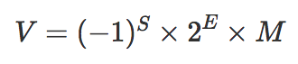

# Number进度详解，0.1 + 0.2 !== 0.3

>js中奇怪的现象：0.1+0.2 = 0.30000000000000004  0.1+0.2 不是等于 0.3 吗？很多人都遇见过这个问题，下面将详细介绍为什么会出现这个问题。

## js中数字的存储---浮点数存储
-   js 中不管整数还是小数，都只有Number类型，遵循 IEEE 754 标准，通过64位来表示，也就是 double 双精度浮点数。

### 进制转换
1. 二进制转十进制
   ```js
   11.01 --> 1*2^1 + 1*2^0 + 0*2^{-1} + 1*2^{-2} = 3.25
   ```

2. 十进制转二进制
   -   整数：除二取余，然后倒序排列，高位补零。
       ```js
       2 --> 2 / 2 = 1 --- 0    1 / 2 = 0 --- 1 到着排序为10
       ```
   -   小数：对小数点以后的数乘以2，取结果的整数部分（不是1就是0喽），然后再用小数部分再乘以2，再取结果的整数部分……以此类推，直到小 数部分为0或者位数已经够了就OK了。
       ```js
       0.1:
       0.1 * 2 = 0.2 --- 0
       0.2 * 2 = 0.4 --- 0 
       0.4 * 2 = 0.8 --- 0
       0.8 * 2 = __1.6__ --- __1__ 
       __0.6__ * 2 = 1.2 --- 1
       0.2 * 2 = 0.4 --- 0 

       0.1 -> 0.0001100110011001...(无限循环)
       ```

### 浮点数

1. 浮点数的计算公式

   

2. 64位浮点数
    -   第0位：符号位，0表示正数，1表示负数(s)
    -   第1位到第11位：11位，储存指数部分（e）
    -   第12位到第63位：52位储存小数部分（即有效数字） (m)

3. E 是一个无符号整数，因为长度是11位，取值范围是 0~2047。但是科学计数法中的指数是可以为负数的，所以约定减去一个中间数 1023，[0,1022] 表示为负，[1024,2047] 表示为正。

4. 比如：4.5
   -   转换成二进制：100.1
   -   按照上面公式转换为1.001 * 2^2
   -   m 为 001，e 为 1023 + 2 = 1025，s 为 0，1可以舍去

5. 从上面可以看出，一个数转成二进制还需要转成1.xxx * 2^e 形式，xxx存储在m中，m最大为52位，超出的会被舍去。
   52位全是1则表示js最大的安全数 ：__Number.MAX_SAFE_INTEGER == Math.pow(2,53) - 1__，是53，因为前面还有个1。

6. js中大于数字大于 2^53 会出现什么情况呢？
   ```js
    (2^53, 2^54) 之间的数会两个选一个，只能精确表示偶数
    (2^54, 2^55) 之间的数会四个选一个，只能精确表示4个倍数
    ... 依次跳过更多2的倍数
   ```

   数字超过 Number.MAX_SAFE_INTEGER 即Math.pow(2, 53)， 转换成二进制就是 1 和 53 个0，1省略，53个0存在m中，m只有52位，所以最后的0舍去。
   Math.pow(2, 53) + 1，转成二进制就是 1 + 53 个0，和 Math.pow(2, 53) 一样 。

   ```js
   Math.pow(2, 53) === Math.pow(2, 53) + 1  // true

   // todo why? 超过52位 截取是怎么截取的？
    console.log((Math.pow(2, 53)).toString(2))
    100000000000000000000000000000000000000000000000000000

    console.log((Math.pow(2, 53) + 1).toString(2))
    100000000000000000000000000000000000000000000000000000

    console.log((Math.pow(2, 53) + 2).toString(2))
    100000000000000000000000000000000000000000000000000010

   console.log((Math.pow(2, 53) + 3).toString(2))
    100000000000000000000000000000000000000000000000000100

    console.log((Math.pow(2, 53) + 4).toString(2))

    100000000000000000000000000000000000000000000000000100

    console.log((Math.pow(2, 53) + 5).toString(2))
    100000000000000000000000000000000000000000000000000100

    console.log((Math.pow(2, 53) + 6).toString(2))
    100000000000000000000000000000000000000000000000000110
   ```

7. 由于 E 最大值是 1023，所以最大可以表示的整数是 2^1024 - 1，这就是能表示的最大整数。但你并不能这样计算这个数字，因为从 2^1024 开始就变成了 Infinity。
   > Infinity 的初始值是 Number.POSITIVE_INFINITY。Infinity（正无穷大）大于任何值。


### 0.1 + 0.2 !== 0.3

1. 0.1 和 0.2 转换成二进制
   ```js
   0.1 -> 0.0001100110011001...(无限循环)
   0.2 -> 0.0011001100110011...(无限循环)
   ```
   超过的截取，产生精度损失。

2. 对阶运算，小数点对其相加，又产生精度损失。
   ```js
   0.0100110011001100110011001100110011001100110011001100 
   ```
   结果转换成十进制之后就是0.30000000000000004

所以：0.1 + 0.2 === 0.30000000000000004。其他的小数运算也会出现类似的结果。

### 为什么 x = 0.1 得到 0.1

-   实际得到的0.1不是真正的0.1，是浏览器处理过的。

-   上面说过，m中最多52位，2^53=9007199254740992，对应科学计数尾数是 9.007199254740992，这也是 JS 最多能表示的精度。它的长度是 16，所以可以近似使用 toPrecision(16) 来做精度运算，超过的精度会自动做凑整处理。

-   所以：0.10000000000000000555.toPrecision(16) = 0.1000000000000000，去掉末尾的零后正好为 0.1

### toPrecision 和 toFixed

1. 共同点：把数字转成字符串供展示使用。

2. 不同点
   -   toPrecision 是处理精度，精度是从左至右第一个不为0的数开始数起。
   -   toFixed是小数点后指定位数取整，从小数点开始数起。

3. 用toFixed来做四舍五入有问题：
   1.005.toFixed(2)返回的是1.00而不是1.01。
   原因：1.005实际对应的数字是1.00499999999999989，在四舍五入时全部被舍去。
   解决：使用四舍五入函数 Math.round() 来处理。

   所以计算过程中不要使用这两个方法，仅用于结果展示。

## 解决精度问题
误差出现在进制转换个对阶运算中。

1. 最简单的方法是转化成整数运算。整数（不超过最大安全数）不会出现误差。

2. 第三方库：Math.js，  big.js 等

3. 对数字的计算非常严格，可以将参数丢给后端，让后端进行计算，再返回给你结果。

## 参考文献
1. [0.1 + 0.2不等于0.3？为什么JavaScript有这种“骚”操作？](https://juejin.cn/post/6844903680362151950)
2. [Number - 加减危机 —— 为什么会出现这样的结果？](https://github.com/LiangJunrong/document-library/blob/master/JavaScript-library/JavaScript/%E5%85%B6%E4%BB%96/Number%20-%20%E5%8A%A0%E5%87%8F%E5%8D%B1%E6%9C%BA.md)
3. [面试必备之详解JS数字精度](https://segmentfault.com/a/1190000021684144)
4. [抓住数据的小尾巴 - JS浮点数陷阱及解法](https://zhuanlan.zhihu.com/p/30703042)
5. [JS数字存储问题](https://blog.csdn.net/user1033161981/article/details/105853074)
