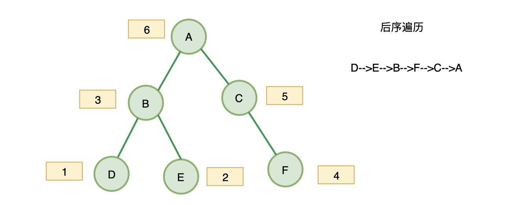

主要介绍JS实现二叉树的深度优先（前序，中序，后序）遍历和广度优先遍历算法，每种遍历法都有递归和非递归两种思路，也比较详细的介绍了 `leetCode` 上的锯齿形层序遍历算法，简单的写了下求二叉树的深度，求二叉树的宽度算法


## 写在前面

本文主要是介绍JS实现二叉树的深度优先（前序，中序，后序）遍历和广度优先遍历算法，每种遍历法都有递归和非递归两种思路，也比较详细的介绍了 `leetCode` 上的[锯齿形层序遍历](https://leetcode-cn.com/problems/binary-tree-zigzag-level-order-traversal/)算法。另外简单的写了下求二叉树的深度，求二叉树的宽度两种算法。


当然，很多算法的思路都是参考网上实现的，图片也是从网上找的，配上图片好理解。


补充一个知识，二叉树节点的定义：

```js
function TreeNode(val, left, right) {
    this.val = (val===undefined ? 0 : val)
    this.left = (left===undefined ? null : left)
    this.right = (right===undefined ? null : right)
}
```


在介绍之前，先简单说一下二叉树的几种遍历方式。


## 二叉树的遍历方式

1. 深度优先遍历(Depth First Search)：沿着树的深度遍历树的节点，尽可能深的搜索树的分支。

   又分为以下三种方式：

   - 前序遍历：访问根结点的操作发生在遍历其左右子树之前。

   - 中序遍历：访问根结点的操作发生在遍历其左右子树之间。

   - 后序遍历：访问根结点的操作发生在遍历其左右子树之后。

2. 广度优先遍历(Breadth First Search)：按照树的层次，每层从左至右依次遍历。

3. 锯齿形层序遍历：先从左往右，再从右往左进行下一层遍历，以此类推，层与层之间交替进行。


## 深度优先遍历

再啰嗦一下定义：沿着树的深度遍历树的节点，尽可能深的搜索树的分支。


### 前序遍历

[LeetCode](https://leetcode-cn.com/problems/binary-tree-preorder-traversal/)


再啰嗦一下定义：对于二叉树中的任意一个节点，先打印该节点，然后是它的左子树，最后右子树。遍历左子树的时候，又是先遍历左子树的根节点，然后左子树的左子树，左子树的右子树…….


看图基本就懂啦：


#### 递归实现

根据定义直接写出递归实现：

```js
const preorderTraversal = (root) => {
    let res = []
    const preorder = (node) => {
        if (node) {
            res.push(node.val)
            traversal(node.left)
            traversal(node.right)
        }
    }
    traversal(root)
    return res
}
```


#### 迭代 + 栈实现

实际上递归就是使用了栈，所以我们可以使用栈来模拟递归。

利用栈来记录遍历的过程。


思路：

1. 首先根入栈。
2. 将根节点出栈，将根节点值放入结果数组中。
3. 然后遍历左子树、右子树，因为栈是先入后出，所以，我们先右子树节点入栈，然后左子树节点入栈。
4. 将栈顶的节点（可能是左子树的节点）出栈，值放入结果数组中。
5. 继续上面的步骤3。.........

依次循环出栈遍历入栈，直到栈为空，遍历完成


从https://www.jianshu.com/p/1e6f0228211e嫖来的图，帮助理解：


代码：

```js
const preorderTraversal = (root) => {
    let stack = []
    let res = []
    
    if (root) {
        stack.push(root)
    }
    while (stack.length) {
        const node = stack.pop()
        res.push(node.val)
        if (node.right) {
            stack.push(node.right)
        }
        if (node.left) {
            stack.push(node.left)
        }
    }
    return res
}
```


### 中序遍历

[LeetCode](https://leetcode-cn.com/problems/binary-tree-inorder-traversal/)


再啰嗦一下定义：对于二叉树中的任意一个节点，先打印它的左子树，然后是该节点，最后右子树。


还是看图就懂：


#### 递归实现

根据定义直接写出递归实现：

```js
const inorderTraversal = (root) => {
    let res = []
    const inorder = (node) => {
        if (node) {
            inorder(root.left)
            res.push(root.val)
            inorder(root.right)
        }
    }
    inorder(root)
    return res
}
```


#### 迭代 + 栈实现


##### 第一种方法

这种方法思路比较简单：

1. 如果存在左子节点，依次入栈。
2. 如果左子节点不存在，右子节点存在，输出当前节点，去右子节点中迭代。
3. 如果左右节点都不存在，输出当前节点，栈顶元素出栈，也就是回退到上一层，此时置空左子节点，防止while循环重复进入。


代码：

```js
const inorderTraversal = (root) => {
    let res = []
    let stack = []

    while (root || stack.length) {
        if (root.left) {
            stack.push(root)
            root = root.left
        } else if (root.right) {
            res.push(root.val)
            root = root.right
        } else {
            res.push(root.val)
            root = stack.pop()
            root.left = null
        }
    }
    return res
}
```


##### 第二种方法

思路：

1. 用一个变量存放当前访问的节点。
2. 如果节点存在，就把他压入栈中，然后将左子节点作为当前访问节点进行下一轮循环。
3. 如果节点不存在，则将栈顶的节点出栈，值放入结果数组中，将右子节点作为当前访问节点进行下一轮循环。

依次循环，直到栈为空，遍历完成


代码：

```js
const inorderTraversal = (root) => {
    let res = []
    let stack = []
    let node = root

    while (stack.length || node) {
        if (node) {
            stack.push(node)
            node = node.left
        } else {
            const pop = stack.pop()
            res.push(pop.val)
            node = pop.right
        }
    }
    return res
}
```


### 后序遍历

[LeetCode](https://leetcode-cn.com/problems/binary-tree-postorder-traversal/)


再啰嗦一下定义：对于二叉树中的任意一个节点，先打印它的左子树，然后是右子树，最后该节点。


还是看图就懂：




#### 递归实现

根据定义直接写出递归实现：

```js
const postorderTraversal = (root) => {
    let res = []
    const postorder = (node) => {
        postorder(node.left)
        postorder(node.right)
        res.push(node.val)
    }
    postorder(root)
    return res
}
```


#### 迭代 + 栈实现


##### 第一种：前序遍历的逆向思维

思路：

1. 和前序遍历思路一样，不过入栈顺序改为当前节点，左子节点，右子节点。
2. 最后用数组`reverse`反转方法，输出就变成了左子节点，右子节点，当前节点


从https://www.jianshu.com/p/1e6f0228211e嫖来的图，帮助理解：


代码：

```js
const postorderTraversal = (root) => {
    let res = []
    let stack = []

    if (root) {
        stack.push(root)
    }
    while (stack.length) {
        const node = stack.pop()
        res.push(node.val)
        node.left && stack.push(node.left)
        node.right && stack.push(node.right)
    }
    return res.reverse()
}
```


##### 第二种：中序遍历第一种方法的思路

思路：

1. 如果存在左子节点，依次入栈。

2. 如果左子节点不存在，右子节点存在，该节点入栈 ，去右子节点中迭代。

3. 如果左右节点都不存在，输出当前节点，栈顶元素出栈，也就是当前节点的父节点。

   如果父节点有左子节点，说明刚刚访问的是左子节点，置空，防止while循环重复进入，下次循环应该访问该右子节点。

   如果没有左子节点，但有右子节点，说明刚刚访问的是右子节点，置空，防止while循环重复进入，下次循环就打印该节点。


代码：

```js
const postorderTraversal = (root) => {
    let res = []
    let stack = []

    while (root || stack.length) {
        if (root.left) {
            stack.push(root)
            root = root.left
        } else if (root.right) {
            stack.push(root)
            root = root.right
        } else {
            res.push(root.val)
            root = stack.pop()
            if (root.left) {
                root.left = null
                continue
            }
            if (root.right) {
                root.right = null
            }
        }
    }
    return res
}
```


### 总结

关于二叉树的前序、中序、后续遍历，使用递归的方法不用多说，迭代方法，通过对`栈`的应用，对节点不同顺序的压入栈中，从而实现不同顺序的遍历。


## 广度优先遍历


再啰嗦一下定义：按照树的层次，每层从左至右依次遍历。


这里输出有两种形式：

1. 二维数组：[1,

   [2, 3],

   [4]

   ]

2. 扁平化数组：[1, 2, 3, 4]


当然，你要是不嫌麻烦，可以将第一种得到的二维数组，使用数组扁平化方法`flatten`，得到第二种形式。

这里两种形式都写一下。


### 二维数组

[LeetCode](https://leetcode-cn.com/problems/binary-tree-level-order-traversal/)


#### 递归实现


思路：其实就和深度优先遍历的前序、中序、后续遍历一样。

1. 深度优先遍历在每层上是先输出左节点，然后输出右节点。
2. 所以用个二维数组存储，一维就是深度，二维用于该深度下的节点值。


代码：

```js
const levelOrder = (root) => {
    let res = []

    const levelLoop = (node, level) => {
        if (node) {
            res[level] = res[level] || []
            res[level].push(node.val)
            levelLoop(node.left, ++level)
            levelLoop(node.right, ++level)
        }
    }
    levelLoop(root, 0)
    return res
}
```


#### 迭代 + 队列


思路：使用队列来保存节点，每轮循环中，我们都取一层出来，将它们的左右孩子依次放入队列。


代码： 

```js
const levelOrder = (root) => {
    let res = []
    let queue = []
    let level = 0

    if (root) {
        queue.push(root)
    }
    while (queue.length) {
        let n = queue.length
        res[level] = []

        for (let i = 0; i < n; i++) {
            const node = queue.pop()
            res[level].push(node.val)
            // 从左往右入队
            node.left && queue.unshift(node.left)
            node.right && queue.unshift(node.right)
        }
        level++
    }
    return res
}
```


### 扁平化数组


#### 迭代 + 队列


思路：这个方法就是上面 **扁平化数组的迭代 + 队列** 的简化。

1. 我不需要知道这个节点是在第几层。
2. 并且队列中入队保存的节点是一层一层，从左往右的，所以出队列的时候就保证顺序一致了。


代码：

```js
const levelOrder = (root) => {
    let res = []
    let queue = []

    if (root) {
        queue.shift(root)
    }
    while (queue.length) {
        const node = queue.pop()
        res.push(node.val)
        // 从左往右入队
        node.left && queue.unshift(node.left)
        node.right && queue.unshift(node.right)
    }
    return res
}
```


#### 递归 + 队列

这个和 **迭代 + 队列** 差不多，只是用递归函数代替 `while` 循环


## 锯齿形层序遍历

[LeetCode](https://leetcode-cn.com/problems/binary-tree-zigzag-level-order-traversal/)


再啰嗦一下定义：先从左往右，再从右往左进行下一层遍历，以此类推，层与层之间交替进行。


## 补充两个算法

这里只是简单写了一下。


### 1. 求二叉树的深度

[LeetCode](https://leetcode-cn.com/problems/er-cha-shu-de-shen-du-lcof/)


定义：从根结点到叶结点依次经过的结点（含根、叶结点）形成树的一条路径，最长路径的长度为树的深度。


#### 递归实现

思路：分别计算左子树的深度和右字数的深度，然后选出两个值中的较大值。


代码：

```js
```


### 2. 求二叉树的宽度

[LeetCode](https://leetcode-cn.com/problems/maximum-width-of-binary-tree/)


定义：二叉树各层结点个数的最大值。


1. [JS实现二叉树的前序、中序、后续、层序遍历](https://juejin.cn/post/6844904063650234375)
2. [JavaScript解：前序遍历二叉树](https://leetcode-cn.com/problems/binary-tree-preorder-traversal/solution/javascriptjie-qian-xu-bian-li-er-cha-shu-by-user77/)
3. [JavaScript实现二叉树的遍历](https://www.jianshu.com/p/1e6f0228211e)
4. [二叉树前中后序遍历非递归实现（JavaScript）](https://juejin.cn/post/6844904038060785671)