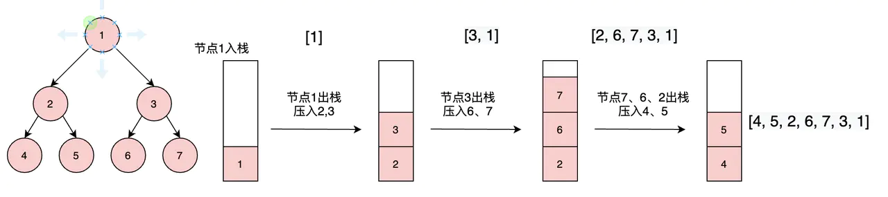

主要介绍JS实现二叉树的深度优先（前序，中序，后序）遍历和广度优先遍历算法，每种遍历法都有递归和非递归两种思路，也比较详细的介绍了 `leetCode` 上的锯齿形层序遍历算法，简单的写了下求二叉树的深度，求二叉树的宽度算法

      

      ## 写在前面

      本文主要是介绍JS实现二叉树的深度优先（前序，中序，后序）遍历和广度优先遍历算法，每种遍历法都有递归和非递归两种思路，也比较详细的介绍了 `leetCode` 上的[锯齿形层序遍历](https://leetcode-cn.com/problems/binary-tree-zigzag-level-order-traversal/)算法。另外简单的写了下求二叉树的深度，求二叉树的宽度两种算法。

      

      当然，很多算法的思路都是参考网上实现的，图片也是从网上找的，配上图片好理解。

      

      补充一个知识，二叉树节点的定义：

      ```js
      function TreeNode(val, left, right) {
          this.val = (val===undefined ? 0 : val)
          this.left = (left===undefined ? null : left)
          this.right = (right===undefined ? null : right)
      }
      ```

      

      在介绍之前，先简单说一下二叉树的几种遍历方式。

      

      ## 二叉树的遍历方式

      1. 深度优先遍历(Depth First Search)：沿着树的深度遍历树的节点，尽可能深的搜索树的分支。

         又分为以下三种方式：

         - 前序遍历：访问根结点的操作发生在遍历其左右子树之前。

         - 中序遍历：访问根结点的操作发生在遍历其左右子树之间。

         - 后序遍历：访问根结点的操作发生在遍历其左右子树之后。

      2. 广度优先遍历(Breadth First Search)：按照树的层次，每层从左至右依次遍历。

      3. 锯齿形层序遍历：先从左往右，再从右往左进行下一层遍历，以此类推，层与层之间交替进行。

      

      ## 深度优先遍历

      再啰嗦一下定义：沿着树的深度遍历树的节点，尽可能深的搜索树的分支。

      

      ### 前序遍历

      [LeetCode题目](https://link.juejin.cn/?target=https%3A%2F%2Fleetcode-cn.com%2Fproblems%2Fbinary-tree-preorder-traversal%2F)

      

      再啰嗦一下定义：对于二叉树中的任意一个节点，先打印该节点，然后是它的左子树，最后右子树。遍历左子树的时候，又是先遍历左子树的根节点，然后左子树的左子树，左子树的右子树…….

      

      看图基本就懂啦：

      

      

      #### 递归实现

      根据定义直接写出递归实现：

      ```js
      const preorderTraversal = (root) => {
          let res = []
          const preorder = (node) => {
              if (node) {
                  res.push(node.val)
                  traversal(node.left)
                  traversal(node.right)
              }
          }
          traversal(root)
          return res
      }
      ```

      

      #### 迭代 + 栈实现

      实际上递归就是使用了栈，所以我们可以使用栈来模拟递归。

      利用栈来记录遍历的过程。

      

      思路：

      1. 首先根入栈。
      2. 将根节点出栈，将根节点值放入结果数组中。
      3. 然后遍历左子树、右子树，因为栈是先入后出，所以，我们先右子树节点入栈，然后左子树节点入栈。
      4. 将栈顶的节点（可能是左子树的节点）出栈，值放入结果数组中。
      5. 继续上面的步骤3。.........

      依次循环出栈遍历入栈，直到栈为空，遍历完成

      

      从https://www.jianshu.com/p/1e6f0228211e嫖来的图，帮助理解：

      

      

      代码：

      ```js
      const preorderTraversal = (root) => {
          let stack = []
          let res = []
          
          if (root) {
              stack.push(root)
          }
          while (stack.length) {
              const node = stack.pop()
              res.push(node.val)
              if (node.right) {
                  node.right && stack.push(node.right)
              }
              if (node.left) {
                  stack.push(node.left)
              }
          }
          return res
      }
      ```

      

      ### 中序遍历

      再啰嗦一下定义：对于二叉树中的任意一个节点，先打印它的左子树，然后是该节点，最后右子树。

      

      还是看图就懂：

      

      

      #### 递归实现

      根据定义直接写出递归实现：

      ```js
      const inorderTraversal = (root) => {
          let res = []
          const inorder = (node) => {
              if (node) {
                  inorder(root.left)
                  res.push(root.val)
                  inorder(root.right)
              }
          }
          inorder(root)
          return res
      }
      ```

      

      #### 迭代 + 栈实现

      思路：

      1. 用一个变量存放当前访问的节点。
      2. 如果节点存在，就把他压入栈中，然后将左子节点作为当前访问节点进行下一轮循环。
      3. 如果节点不存在，则将栈顶的节点出栈，值放入结果数组中。
      4. 将右子节点作为当前访问节点进行下一轮循环。

      依次循环，直到栈为空，遍历完成

      

      从https://www.jianshu.com/p/1e6f0228211e嫖来的图，帮助理解：

      

      

      代码：

      ```js
      const inorderTraversal = (root) => {
          let res = []
          let stack = []
          let node = root
      
          while (stack.length || node) {
              if (node) {
                  stack.push(node)
                  node = node.left
              } else {
                  const pop = stack.pop()
                  res.push(pop.val)
                  node = pop.right
              }
          }
          return res
      }
      ```

      

      ### 后序遍历

      再啰嗦一下定义：对于二叉树中的任意一个节点，先打印它的左子树，然后是右子树，最后该节点。

      

      还是看图就懂：

      

      

      #### 递归实现

      根据定义直接写出递归实现：

      ```js
      const postorderTraversal = (root) => {
          let res = []
          const postorder = (node) => {
              postorder(node.left)
              postorder(node.right)
              res.push(node.val)
          }
          postorder(root)
          return res
      }
      ```

      

      #### 迭代 + 栈实现

      思路：

      

      从https://www.jianshu.com/p/1e6f0228211e嫖来的图，帮助理解：

      

      

      代码：

      ```js
      ```

      

      ### 总结

      关于二叉树的前序、中序、后续遍历，使用递归的方法不用多说，迭代方法，通过对`栈`的应用，对节点不同顺序的压入栈中，从而实现不同顺序的遍历。

      

      ## 广度优先遍历

      再啰嗦一下定义：按照树的层次，每层从左至右依次遍历。

      

      ### 递归实现

      

      ### 迭代 + 栈实现

      

      ## 锯齿形层序遍历

      再啰嗦一下定义：先从左往右，再从右往左进行下一层遍历，以此类推，层与层之间交替进行。

      

      ## 补充两个算法

      这里只是简单写了一下。

      

      ### 1. 求二叉树的深度

      定义：从根结点到叶结点依次经过的结点（含根、叶结点）形成树的一条路径，最长路径的长度为树的深度。

      

      #### 递归实现

      思路：分别计算左子树的深度和右字数的深度，然后选出两个值中的较大值。

      

      代码：

      ```js
      ```

      

      ### 2. 求二叉树的宽度

      定义：二叉树各层结点个数的最大值。

      

      1. [JS实现二叉树的前序、中序、后续、层序遍历](https://juejin.cn/post/6844904063650234375)
      2. [JavaScript解：前序遍历二叉树](https://leetcode-cn.com/problems/binary-tree-preorder-traversal/solution/javascriptjie-qian-xu-bian-li-er-cha-shu-by-user77/)
      3. [JavaScript实现二叉树的遍历](https://www.jianshu.com/p/1e6f0228211e)