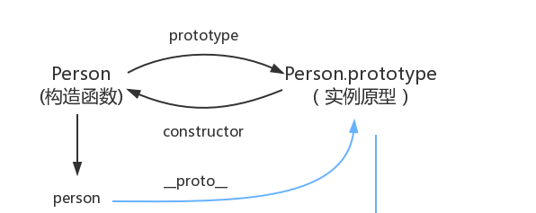

# 原型和原型链

## 前言

1. JavaScript 是动态的，并且本身不提供一个 class 实现。（在 ES2015/ES6 中引入了 class 关键字，但那只是语法糖，JavaScript 仍然是基于原型的）。

2. MDN上的[原型和原型链](https://developer.mozilla.org/zh-CN/docs/Web/JavaScript/Inheritance_and_the_prototype_chain)的介绍：

  > 每个实例对象（ object ）都有一个私有属性（称之为 \__proto__ ）指向它的构造函数的原型对象（prototype ）。该原型对象也有一个自己的原型对象( \__proto__ ) ，层层向上直到一个对象的原型对象为 null。根据定义，null 没有原型，并作为这个原型链中的最后一个环节。


## 原型
1. 在 JavaScript 中，构造器其实就是一个普通的函数。当使用 new 操作符 来作用这个函数时，它就可以被称为构造方法（构造函数）

2. 

  

3. 每一个构造函数都拥有一个prototype属性，这个属性指向一个对象，也就是原型对象。当使用这个构造函数创建实例的时候，prototype属性指向的原型对象就成为实例的原型对象。

4. 原型对象默认拥有一个constructor属性，指向指向它的那个构造函数。

5. 每个对象都拥有一个隐藏的属性[[prototype]]，指向它的原型对象，这个属性可以通过 Object.getPrototypeOf(obj) 或 obj.\__proto__ 来访问。

6. 由图可知： __对象.\__proto\__ === 函数.prototype__

7. 原型对象就是用来存放实例中共有的那部分属性。

8. 访问对象的属性时，JavaScript会首先在对象自身的属性内查找，若没有找到，则会跳转到该对象的原型对象中查找。

```js
```


9. 万物继承自Object.prototype。

真的继承了吗？，引用《你不知道的JavaScript》中的话：

继承意味着复制操作，然而 JavaScript 默认并不会复制对象的属性，相反，JavaScript 只是在两个对象之间创建一个关联，这样，一个对象就可以通过委托访问另一个对象的属性和函数，所以与其叫继承，委托的说法反而更准确些。


## 参考文献
1. [继承与原型链](https://developer.mozilla.org/zh-CN/docs/Web/JavaScript/Inheritance_and_the_prototype_chain)
2. [三分钟看完JavaScript原型与原型链](https://juejin.cn/post/6844903567375990791)
3. [JavaScript深入之从原型到原型链](https://github.com/mqyqingfeng/blog/issues/2)
4. [一张图搞定JS原型&原型链](https://segmentfault.com/a/1190000021232132)
5. [JavaScript 原型和原型链](https://zhuanlan.zhihu.com/p/39549472)