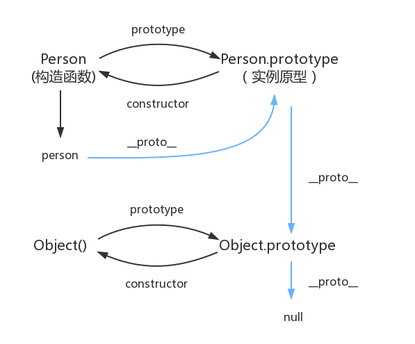

# 原型和原型链

## 前言

1. JavaScript 是动态的，并且本身不提供一个 class 实现。（在 ES2015/ES6 中引入了 class 关键字，但那只是语法糖，JavaScript 仍然是基于原型的）。

2. 原型也是一个对象，通过原型可以实现对象的属性继承。

3. MDN上的[原型和原型链](https://developer.mozilla.org/zh-CN/docs/Web/JavaScript/Inheritance_and_the_prototype_chain)的介绍：

  > 每个实例对象（ object ）都有一个私有属性（称之为 \_\_proto\_\_ ）指向它的构造函数的原型对象（prototype ）。该原型对象也有一个自己的原型对象( \_\_proto\_\_ ) ，层层向上直到一个对象的原型对象为 null。根据定义，null 没有原型，并作为这个原型链中的最后一个环节。


## 原型
1. 原型对象的作用：是用来存放实例中共有的那部份属性、方法，可以大大减少内存消耗。

2. 图解：

    

3. 每一个构造函数都拥有一个prototype属性，这个属性指向一个对象，也就是原型对象。当使用这个构造函数创建实例的时候，prototype属性指向的原型对象就成为实例的原型对象。

4. 原型对象默认拥有一个constructor属性，指向指向它的那个构造函数。

5. 每个对象都拥有一个隐藏的属性[[prototype]]，指向它的原型对象，这个属性可以通过 Object.getPrototypeOf(obj) 或 obj.\_\_proto\_\_ 来访问。

6. 由图可知： __对象.\_\_proto\_\_ === 函数.prototype__

## 原型链
1. 原型对象自身也是一个对象，他也可能是由构造函数实例化来的，所以也有自己的原型，这样层层上溯，就形成了一个类似链表的结构，这就是原型链。

2. 图解：

    

3. 所有原型链的终点都是Object函数的prototype属性，因为在JavaScript中的对象都默认由Object()构造。Objec.prototype指向的原型对象同样拥有原型，不过它的原型是null，而null则没有原型。

4. 万物继承自Object.prototype。

## 几个概念：
   -   js分为 __函数对象__ 和 __普通对象__，每个对象都有\_\_proto\_\_属性，但是只有函数对象才有prototype属性。

   -   Object、Function都是js内置的函数, 类似的还有我们常用到的Array、RegExp、Date、Boolean、Number、String。

   -   在 JavaScript 中，构造器其实就是一个普通的函数。当使用 new 操作符 来作用这个函数时，它就可以被称为构造方法（构造函数）。

## 看代码：
通过生动形象的图，相信概念这些也差不多了解了，下面通过代码来详细介绍。

首先，一个构造函数 Person

  ```js
  function Person (name, age) {
    this.name = name
    this.age = age
    
    this.getInfo = function () {
      console.log(this.name + this.age)
    }
  }
  ```

在 Person 的原型上加一个属性 sex

  ```js
  Person.prototype.sex = 'man'
  ```

使用new 生成两个实例对象 p1 和p2，打印出p1 和 p2 的属性

  ```js
  let p1 = new Person()
  let p2 = new Pewson('xu', 18)
  console.log(p1)
  /* 
    age: undefined
    getInfo: ƒ () {
      arguments: null
      caller: null
      length: 0
      name: ""
      prototype: {constructor: ƒ}
      __proto__: ƒ ()
      [[FunctionLocation]]: VM266:5
      [[Scopes]]: Scopes[2]
    }
    name: undefined
    __proto__:
    {
      sex: "man"
      constructor: ƒ Person(name, age) {
        arguments: null
        caller: null
        length: 2
        name: "Person"
        prototype: {sex: "man", constructor: ƒ}
        __proto__: ƒ ()
        [[FunctionLocation]]: VM266:1
        [[Scopes]]: Scopes[2]
      }
      __proto__: Object
    }
  */
  ```
可以看出：
  -   p1.\_\_proto\_\_ === Person.prototype
  -   Person.prototype.constructor === Person
  -   prototype只有函数对象有。每个对象都有\_\_proto\_\_指向他的原型对象。

打印p1,p2的sex

```js
console.log(p1.sex, p2.sex) // man man
```

从上面可以看出，p1，p2都没有sex属性，但是却打印出了，按上面打印出的p1来看，sex属性是在p1.\_\_proto\_\_，访问sex 应该是p1.\_\_proto\_\_.sex？
因为访问对象的属性时，JavaScript会首先在对象自身的属性内查找，若没有找到，则会跳转到该对象的原型对象中查找。所以，p1.sex，p1没有sex属性，在原型对象中去找。

接着修改p1 的sex属性

```js
p1.sex = 'woman'

console.log(p1)
/*
  age: undefined
  getInfo: ƒ ()
  name: undefined
  sex: "woman"
  __proto__: {
    sex: "man"
    tel: "110"
    constructor: ƒ Person(name, age)
    __proto__: Object
  }
*/

console.log(p2)
/*
  age: 18
  getInfo: ƒ ()
  name: xuxu
  __proto__: {
    sex: "man"
    tel: "110"
    constructor: ƒ Person(name, age)
    __proto__: Object
  }
*/

console.log(p1.sex, p2.sex) // woman, man
```
对比p1 p2 可以看出，p1本身没有sex属性，设置p1.sex实际上在p1对象上添加一个sex属性，上面提到过，JavaScript会首先在对象自身的属性内查找，找不到才在原型对象上找，p1.sex自身有，所以不用在原型找。
这样一来，如果想要覆盖原型链上的一些属性，我们就可以直接在对象中引入这些属性，达到属性隐藏的效果。
上面也可以看出，修改p1自身的属性，不会影响p2对象。那如果修改p1原型上的属性呢？

修改原型上的sex属性，添加一个属性

```js
Person.prototype.sex = 'man or woman'
Person.prototype.tel = '110'

console.log(p1)
/*
  age: undefined
  getInfo: ƒ ()
  name: undefined
  sex: "woman"
  __proto__: {
    sex: "man or woman"
    tel: "110"
    constructor: ƒ Person(name, age)
    __proto__: Object
  }
*/

console.log(p2)
/*
  age: undefined
  getInfo: ƒ ()
  name: undefined
  __proto__: {
    sex: "man or woman"
    tel: "110"
    constructor: ƒ Person(name, age)
    __proto__: Object
  }
*/
```
这样就清晰了，实例对象重写原型上继承的属相、方法，相当于“属性覆盖、属性屏蔽”，这一操作不会改变原型上的属性、方法，自然也不会改变由统一构造函数创建的其他实例，只有修改原型对象上的属性、方法，才能改变其他实例通过原型链获得的属性、方法。

上面的构造函数Person 的 getInfo 方法在每次实例化一个对象的时候都会添加一个，这样比较耗内存。对于Person这样的构造函数，相同的属性、方法还有很多很多，当相同的属性、方法越多，实例化时重复且很耗内存，这时原型、原型链的意义越大。

```js
function Person (name, age, ...) {
  this.name = name
  this.age = age
  ...
  
  this.getInfo = function () {
    console.log(this.name + this.age)
  }
}

// 如果某些属性是公共的，实例化时需要传的参数很多，而且重复，实例对象多的时候，每个对象都有重复的属性，比较耗内存
let p3 = new Person('xu' 18, ...)
```

所以将实例中共有的属性放到原型对象中，让所有实例共享这部分属性。如果想要统一修改所有实例继承的属性，只需要直接修改原型对象中的属性即可。而且每个实例仍然可以重写原型中已经存在的属性来覆盖这个属性，并且不会影响到其他的实例。这是就是原型、原型链的意义所在！可以动态获取，可以节省内存。


## 最后

真的继承了吗？，引用《你不知道的JavaScript》中的话：

继承意味着复制操作，然而 JavaScript 默认并不会复制对象的属性，相反，JavaScript 只是在两个对象之间创建一个关联，这样，一个对象就可以通过委托访问另一个对象的属性和函数，所以与其叫继承，委托的说法反而更准确些。

## 参考文献
1. [继承与原型链](https://developer.mozilla.org/zh-CN/docs/Web/JavaScript/Inheritance_and_the_prototype_chain)
2. [三分钟看完JavaScript原型与原型链](https://juejin.cn/post/6844903567375990791)
3. [JavaScript深入之从原型到原型链](https://github.com/mqyqingfeng/blog/issues/2)
4. [一张图搞定JS原型&原型链](https://segmentfault.com/a/1190000021232132)
5. [JavaScript 原型和原型链](https://zhuanlan.zhihu.com/p/39549472)
6. [原型、原型链相等关系理解](https://juejin.cn/post/6844903989088092174)
